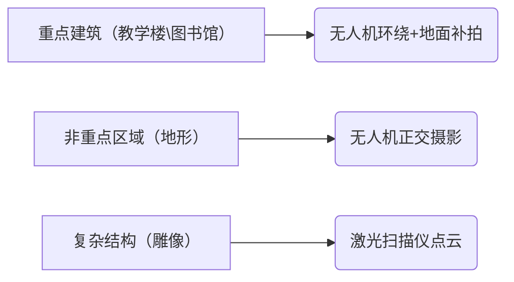
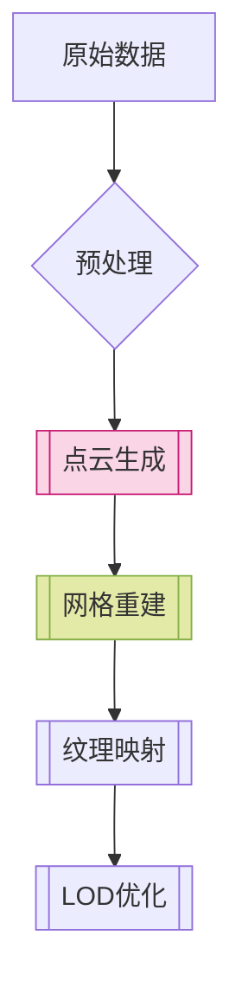
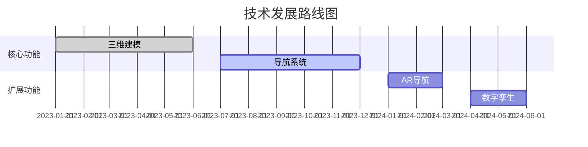

# 3D校园浏览 3D_SchoolView

该项目为3D校园导航/浏览提供开放式解决方案，该项目整合了其他的开源项目与代码。

This project provides an open solution for 3D campus navigation/browsing, integrating various other open source projects and code.

# 项目起源 Project Origin

随着城市化的快速发展，城市规模不断扩大，人口聚集程度提高，教育资源呈现集中化分布趋势。校园占地面积大、建筑数量多且功能分区复杂，不仅新生报到、外来访客会面临“找路难”问题，而且师生在跨区域参加活动、使用不同教学楼设施时，也可能因不熟悉校园而浪费时间，降低办事效率，影响了校园生活和学习体验，因此急需精准高效的校园导航系统提升校园通行效率，优化校园生活节奏。如今，智能手机等智能移动设备在师生群体中高度普及，人们已经习惯使用各类手机应用解决生活中的问题，包括出行导航，

# 🏫 三维校园建模与智能导航系统

[](LICENSE)


## 📋 项目阶段概览
### 1. 数据采集阶段
#### 设备配置（设备有限）
| 设备类型               | 型号                  | 技术参数                    |
|------------------------|-----------------------|-----------------------------|
| 航拍无人机              | DJI Air 3s            | 定位精度 ±1cm               |
| 地面相机                | SONY A7M3             | 2420万像素                  |
| 3D激光扫描仪            | Faro Focus S 350      | 精度 ±1mm                   |

#### 采集方案

#### 环境控制

```yaml
光照条件: 
  - 类型: 阴天/多云
  - 强度: 500-1000lux
地面控制点: 
  - 数量: 15个
  - 材料: 反光标识板
```

---

### 2. 三维建模阶段
#### 处理流程


#### 模型参数
| 指标               | 标准值              |
|--------------------|--------------------|
| 点云密度          | >1000点/m²        |
| UV展开精度        | 0.5px/cm          |
| 三角面数/建筑     | ≤50万             |

---

### 3. 系统开发架构
#### 技术栈
**前端框架**：
```plaintext
┌─────────────┬────────────────────────────┐
│ 平台        │ 技术方案                   │
├─────────────┼────────────────────────────┤
│ 移动端      │ React Native               │
│ 小程序      │ uni-app                    │
│ Web端       │ Vue3 + Three.js            │
└─────────────┴────────────────────────────┘
```

**后端服务**：
```plaintext
██████████████████████████████
█ Spring Boot 3.x (Java17)   █
█ PostgreSQL+PostGIS         █
█ GPS/WiFi/BLE融合定位        █
██████████████████████████████
```

---

### 4. 权限管理系统
#### 安全特性
```diff
+ 双因素认证: JWT+OAuth2.0
+ 动态策略: ABAC属性控制
+ 数据隔离: 多租户Schema
- 旧版本: 基础RBAC (已弃用)
```
---
### 5. 导航功能实现
#### 定位技术对比
| 类型   | 技术方案         | 精度     | 适用场景     |
|--------|------------------|----------|--------------|
| 室外   | RTK-GNSS        | ±10cm   | 开放区域     |
| 室内   | 蓝牙RSSI        | 5m      | 建筑内部     |
| 融合   | EKF算法         | 动态优化 | 过渡区域     |

#### 路径规划示例
```python
def d_star_lite(start, goal):
    open_list = PriorityQueue()
    open_list.put(start)
    while not open_list.empty():
        current = open_list.get()
        if current == goal:
            return reconstruct_path()
        for neighbor in graph.neighbors(current):
            tentative_g = g[current] + cost(current, neighbor)
            if tentative_g < g[neighbor]:
                g[neighbor] = tentative_g
                f = tentative_g + heuristic(neighbor, goal)
                open_list.put(neighbor, f)
```

---

### 6. 测试与部署
#### 压力测试结果
```vega-lite
{
  "$schema": "https://vega.github.io/schema/vega-lite/v5.json",
  "data": {
    "values": [
      {"并发数": 1000, "响应时间": 1.2},
      {"并发数": 3000, "响应时间": 1.8},
      {"并发数": 5000, "响应时间": 2.3}
    ]
  },
  "mark": "line",
  "encoding": {
    "x": {"field": "并发数", "type": "quantitative"},
    "y": {"field": "响应时间", "type": "quantitative"}
  }
}
```

#### 云部署架构
```plaintext
                          +-----------------+
                          |  阿里云 POLARDB |
                          +--------+--------+
                                   ǁ
+----------------+        +--------v--------+        +---------------+
|  前端客户端     +------->+   Spring Cloud  +------->+ MinIO 存储    |
+----------------+        +--------+--------+        +---------------+
                                   ǁ
                          +--------v--------+
                          | Kubernetes集群  |
                          +-----------------+
```

---

### 🚀 扩展功能
#### 多院校适配
```json
{
  "config_template": {
    "file_format": "YAML",
    "required_fields": [
      "campus_boundary",
      "coordinate_system",
      "landmark_list"
    ]
  }
}
```

#### 技术演进路线


---

## 🛠️ 使用指南
### 环境配置
```bash
# 克隆仓库
git clone https://github.com/yourname/3d-campus.git

# 安装依赖
cd server && mvn clean install
cd ../client && npm install

# 环境变量配置
export DB_HOST=127.0.0.1
export CLOUD_KEY=your_cloud_key
```

### 数据目录结构
```plaintext
project-root/
├── data/
│   ├── raw/            # 原始采集数据
│   ├── processed/      # 处理后的点云数据
│   └── textures/       # 材质贴图文件
└── docs/
    └── specifications/ # 技术规范文档
```

---

> 📌 **注意事项**  
> 1. RealityCapture 使用需遵守[授权协议](https://www.capturingreality.com/licensing)  
> 2. 激光扫描仪操作需进行安全培训  
> 3. 部署前需配置防火墙规则  
```
