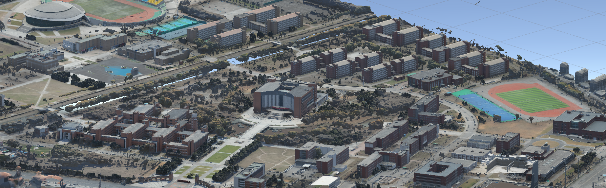

# 3D校园浏览 3D_SchoolView

该项目为沈阳工业大学创新创业项目，为3D校园导航/浏览提供开放式解决方案，该项目整合了其他的开源项目与代码。目前该项目处于初期阶段，未有规模文件。

The project is an innovation and entrepreneurship project of Shenyang University of Technology, which provides an open solution for 3D campus navigation/browsing, and integrates other open source projects and code. At present, the project is in its early stages and there is no scale document.

# 项目起源 Project Origin

随着城市化的快速发展，城市规模不断扩大，人口聚集程度提高，教育资源呈现集中化分布趋势。校园占地面积大、建筑数量多且功能分区复杂，不仅新生报到、外来访客会面临“找路难”问题，而且师生在跨区域参加活动、使用不同教学楼设施时，也可能因不熟悉校园而浪费时间，降低办事效率，影响了校园生活和学习体验，因此急需精准高效的校园导航系统提升校园通行效率，优化校园生活节奏。如今，智能手机等智能移动设备在师生群体中高度普及，人们已经习惯使用各类手机应用解决生活中的问题，包括出行导航。

With the rapid development of urbanization, the scale of cities continues to expand, the degree of population concentration increases, and the distribution of educational resources is centralized. The campus covers a large area, has a large number of buildings and complex functional zoning, not only new students will face the problem of "difficulty in finding the way", but also teachers and students may also waste time because they are not familiar with the campus when they participate in activities and use different teaching building facilities, which reduces the efficiency of work and affects the campus life and learning experience, so there is an urgent need for an accurate and efficient campus navigation system to improve the efficiency of campus traffic and optimize the rhythm of campus life. Nowadays, smart mobile devices such as smartphones are highly popular among teachers and students, and people have become accustomed to using various mobile phone applications to solve problems in life, including travel navigation.

# 🏫 三维校园建模与智能导航系统 
# 3D Campus Modeling and Intelligent Navigation System

[](LICENSE)




## 📋 项目阶段概览 Overview of the project phases
### 1. 数据采集阶段 Data acquisition phase
#### 设备配置（设备有限） Device configuration
| 设备类型 Device type                 | 型号 Model            | 技术参数 Technical parameters     |
|--------------------------------------|-----------------------|-----------------------------|
| 航拍无人机 Aerial photography drones  | DJI Air 3s            | 定位精度 ±1cm                 |
| 地面相机 Terrestrial camera           | SONY A7M3             | 2420万像素                    |
| 3D激光扫描仪 3D laser scanner         | Faro Focus S 350      | 精度 ±1mm                    |

#### 采集方案 Acquisition protocols

```mermaid
graph LR
    A[重点建筑（教学楼\图书馆）] --> B(无人机环绕+地面补拍)
    C[非重点区域（地形）] --> D(无人机正交摄影)
    E[复杂结构（雕像）] --> F(激光扫描仪点云)
```

#### 环境要求 Environmental requirements

```yaml
光照条件: 
  - 类型: 阴天/多云
  - 强度: 500-1000lux
地面控制点: 
  - 数量: 15个
  - 材料: 反光标识板
```

---

### 2. 三维建模阶段 3D modeling phase
#### 处理流程

```mermaid
flowchart TD
    A[原始数据] --> B{预处理}
    B --> C[[点云生成]]
    C --> D[[网格重建]]
    D --> E[[纹理映射]]
    E --> F[[LOD优化]]
    
    style C fill:#f9d5e5,stroke:#c81d77
    style D fill:#e3eaa7,stroke:#86af49
```

##### 点云生成

##### 网格生成（模型生成）

##### 纹理映射


#### 模型参数
| 指标               | 标准值              |
|--------------------|--------------------|
| 点云密度          | >1000点/m²        |
| UV展开精度        | 0.5px/cm          |
| 三角面数/建筑     | ≤50万             |

---

### 3. 系统开发架构 System development architecture
#### 技术栈
**前端框架**：
```plaintext
┌─────────────┬────────────────────────────┐
│ 平台        │ 技术方案                   │
├─────────────┼────────────────────────────┤
│ 移动端      │ React Native               │
│ 小程序      │ uni-app                    │
│ Web端       │ Vue3 + Three.js            │
└─────────────┴────────────────────────────┘
```

**后端服务**：
```plaintext
██████████████████████████████
█ Spring Boot 3.x (Java17)   █
█ PostgreSQL+PostGIS         █
█ GPS/WiFi/BLE融合定位        █
██████████████████████████████
```

---

### 4. 权限管理系统 Permission management system
#### 安全特性
```diff
+ 双因素认证: JWT+OAuth2.0
+ 动态策略: ABAC属性控制
+ 数据隔离: 多租户Schema
- 旧版本: 基础RBAC (已弃用)
```
---
### 5. 导航功能实现 Navigation function implementation
#### 定位技术对比
| 类型   | 技术方案         | 精度     | 适用场景     |
|--------|------------------|----------|--------------|
| 室外   | RTK-GNSS        | ±10cm   | 开放区域     |
| 室内   | 蓝牙RSSI        | 5m      | 建筑内部     |
| 融合   | EKF算法         | 动态优化 | 过渡区域     |

#### 路径规划示例
```python
def d_star_lite(start, goal):
    open_list = PriorityQueue()
    open_list.put(start)
    while not open_list.empty():
        current = open_list.get()
        if current == goal:
            return reconstruct_path()
        for neighbor in graph.neighbors(current):
            tentative_g = g[current] + cost(current, neighbor)
            if tentative_g < g[neighbor]:
                g[neighbor] = tentative_g
                f = tentative_g + heuristic(neighbor, goal)
                open_list.put(neighbor, f)
```

---

### 6. 测试与部署 Testing & Deployment
#### 压力测试结果
```vega-lite
{
  "$schema": "https://vega.github.io/schema/vega-lite/v5.json",
  "data": {
    "values": [
      {"并发数": 1000, "响应时间": 1.2},
      {"并发数": 3000, "响应时间": 1.8},
      {"并发数": 5000, "响应时间": 2.3}
    ]
  },
  "mark": "line",
  "encoding": {
    "x": {"field": "并发数", "type": "quantitative"},
    "y": {"field": "响应时间", "type": "quantitative"}
  }
}
```

#### 云部署架构
```plaintext
                          +-----------------+
                          |  阿里云 POLARDB |
                          +--------+--------+
                                   ǁ
+----------------+        +--------v--------+        +---------------+
|  前端客户端     +------->+   Spring Cloud  +------->+ MinIO 存储    |
+----------------+        +--------+--------+        +---------------+
                                   ǁ
                          +--------v--------+
                          | Kubernetes集群  |
                          +-----------------+
```

---

### 🚀 扩展功能 Extended functionality
#### 多院校适配
```json
{
  "config_template": {
    "file_format": "YAML",
    "required_fields": [
      "campus_boundary",
      "coordinate_system",
      "landmark_list"
    ]
  }
}
```

#### 技术演进路线 Technology Evolution Roadmap

```mermaid
gantt
    title 技术发展路线图
    dateFormat  YYYY-MM
    section 核心功能
    三维建模       :done,    des1, 2024-10, 2024-12
    导航系统       :active,  des2, 2024-11, 2025-05
    section 扩展功能
    AR导航        :         des3, 2025-04, 2025-08
    数字孪生      :         des4, 2025-08, 2025-12
    section 现实应用
    新生测试      :         des5, 2025-08, 2025-10
    正式应用      :         des6, 2025-12, 2026-02
```


---

## 🛠️ 使用指南 Directions for use
### 环境配置
```bash
# 克隆仓库
git clone https://github.com/yourname/3d-campus.git

# 安装依赖
cd server && mvn clean install
cd ../client && npm install

# 环境变量配置
export DB_HOST=127.0.0.1
export CLOUD_KEY=your_cloud_key
```

### 数据目录结构 Data directory structure
```plaintext
project-root/
├── data/
│   ├── raw/            # 原始采集数据
│   ├── processed/      # 处理后的点云数据
│   └── textures/       # 材质贴图文件
└── docs/
    └── specifications/ # 技术规范文档
```

---

> 📌 **注意事项** Precautions
> 1. RealityCapture 使用需遵守[授权协议](https://www.capturingreality.com/licensing)  
> 2. 激光扫描仪操作需进行安全培训  
> 3. 部署前需配置防火墙规则  
